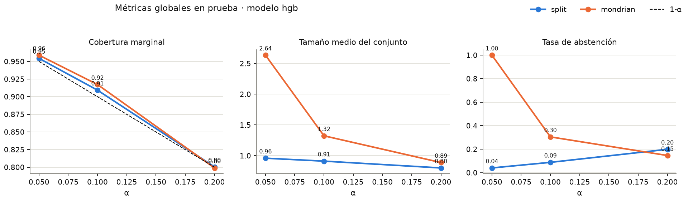
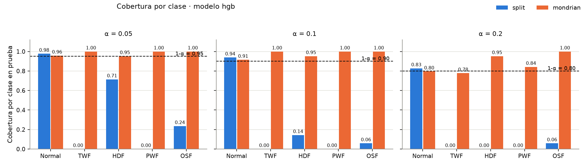
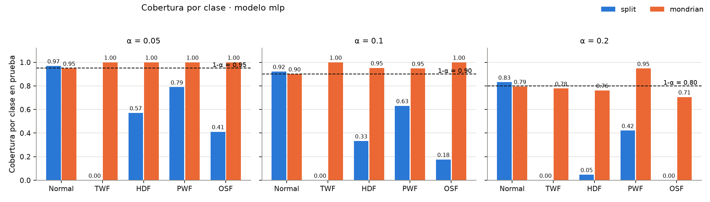
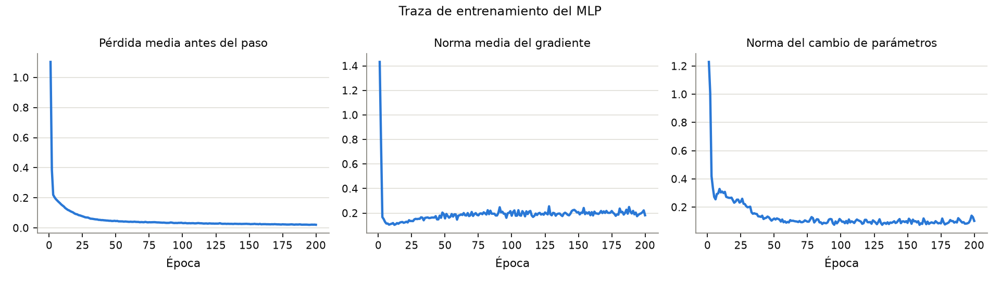

# Resultados: predicción conforme con abstención en AI4I 2020

Ejecución `artifacts/run_2026-09-11_seed42`, reproducible con el bloque de código del
[README](README.md#ejecución-real). Los CSV y las figuras citados están en esa carpeta,
versionada en el repositorio. Nada se seleccionó con prueba:
los tres alpha, la partición y los hiperparámetros se fijaron antes de evaluar.

## Configuración

| Elemento | Valor |
|---|---|
| Datos | `ai4i2020.csv`, SHA-256 `ffc3c28f…9b5a18`, 10 000 filas |
| Política de etiquetas | prioridad TWF > PWF > OSF > HDF; `exclude_only_rnf` (27 filas excluidas) |
| Partición | calibración 0.30, prueba 0.20, semilla 42, estratificada |
| Alphas | 0.05, 0.10, 0.20 |
| Modelo base | HistGradientBoosting, 100 iteraciones, sin early stopping |
| Extensión | MLP 64-64 en PyTorch, Adam 1e-3, 200 épocas, lote 256, 5 061 parámetros |
| Hardware MLP | NVIDIA GeForce RTX 5070 Ti Laptop, torch 2.11.0+cu128, CUDA 12.8 |
| Tiempo total | 52 s para ambos modelos, tres alphas, dos variantes y el benchmark CPU/GPU |

Conteos por clase y bloque (`class_counts.csv`):

| Clase | Entrenamiento | Calibración | Prueba |
|---|---:|---:|---:|
| Normal | 4 821 | 2 893 | 1 929 |
| TWF | 23 | 14 | 9 |
| HDF | 53 | 32 | 21 |
| PWF | 47 | 28 | 19 |
| OSF | 42 | 25 | 17 |

## Métricas globales en prueba (`metrics.csv`)

| Modelo | Variante | α | Cobertura marginal | Tamaño medio | Abstención | Asistida | Humana |
|---|---|---:|---:|---:|---:|---:|---:|
| hgb | split | 0.05 | 0.954 | 0.96 | 0.041 | 0.000 | 0.041 |
| hgb | mondrian | 0.05 | 0.959 | 2.64 | 1.000 | 0.373 | 0.627 |
| hgb | split | 0.10 | 0.909 | 0.91 | 0.088 | 0.000 | 0.088 |
| hgb | mondrian | 0.10 | 0.917 | 1.32 | 0.305 | 0.286 | 0.019 |
| hgb | split | 0.20 | 0.801 | 0.80 | 0.199 | 0.000 | 0.199 |
| hgb | mondrian | 0.20 | 0.799 | 0.89 | 0.146 | 0.018 | 0.129 |
| mlp | split | 0.05 | 0.954 | 0.96 | 0.041 | 0.000 | 0.041 |
| mlp | mondrian | 0.05 | 0.950 | 2.07 | 0.974 | 0.881 | 0.093 |
| mlp | split | 0.10 | 0.902 | 0.90 | 0.096 | 0.000 | 0.096 |
| mlp | mondrian | 0.10 | 0.903 | 1.07 | 0.085 | 0.068 | 0.017 |
| mlp | split | 0.20 | 0.808 | 0.81 | 0.191 | 0.000 | 0.191 |
| mlp | mondrian | 0.20 | 0.794 | 0.85 | 0.148 | 0.002 | 0.147 |

## Cobertura por clase en prueba (`metrics_by_class.csv`)

| Modelo | Variante | α | Normal (1 929) | TWF (9) | HDF (21) | PWF (19) | OSF (17) |
|---|---|---:|---:|---:|---:|---:|---:|
| hgb | split | 0.05 | 0.977 | **0.000** | 0.714 | **0.000** | 0.235 |
| hgb | mondrian | 0.05 | 0.958 | 1.000 | 0.952 | 1.000 | 1.000 |
| hgb | split | 0.10 | 0.938 | **0.000** | 0.143 | **0.000** | 0.059 |
| hgb | mondrian | 0.10 | 0.915 | 1.000 | 0.952 | 1.000 | 1.000 |
| hgb | split | 0.20 | 0.827 | **0.000** | **0.000** | **0.000** | 0.059 |
| hgb | mondrian | 0.20 | 0.795 | 0.778 | 0.952 | 0.842 | 1.000 |
| mlp | split | 0.05 | 0.969 | **0.000** | 0.571 | 0.789 | 0.412 |
| mlp | mondrian | 0.05 | 0.949 | 1.000 | 1.000 | 1.000 | 1.000 |
| mlp | split | 0.10 | 0.922 | **0.000** | 0.333 | 0.632 | 0.176 |
| mlp | mondrian | 0.10 | 0.901 | 1.000 | 0.952 | 0.947 | 1.000 |
| mlp | split | 0.20 | 0.831 | **0.000** | 0.048 | 0.421 | **0.000** |
| mlp | mondrian | 0.20 | 0.794 | 0.778 | 0.762 | 0.947 | 0.706 |

Tamaño medio del conjunto por clase, modelo hgb:

| Variante | α | Normal | TWF | HDF | PWF | OSF |
|---|---:|---:|---:|---:|---:|---:|
| split | 0.05 | 0.98 | 0.78 | 0.71 | 0.05 | 0.24 |
| mondrian | 0.05 | 2.64 | 2.89 | 2.67 | 2.26 | 2.71 |
| split | 0.10 | 0.94 | 0.56 | 0.14 | 0.00 | 0.06 |
| mondrian | 0.10 | 1.31 | 1.78 | 1.48 | 2.05 | 2.00 |
| split | 0.20 | 0.83 | 0.11 | 0.00 | 0.00 | 0.06 |
| mondrian | 0.20 | 0.87 | 1.00 | 1.05 | 1.53 | 1.53 |

## Umbrales calibrados (`thresholds.csv`)

| Modelo | Variante | α | Normal | TWF | HDF | PWF | OSF |
|---|---|---:|---:|---:|---:|---:|---:|
| hgb | split | 0.05 | 0.0019 | 0.0019 | 0.0019 | 0.0019 | 0.0019 |
| hgb | split | 0.10 | 2.1e-5 | 2.1e-5 | 2.1e-5 | 2.1e-5 | 2.1e-5 |
| hgb | mondrian | 0.05 | 0.0001 | ∞ | 0.9821 | 1.0000 | 1.0000 |
| hgb | mondrian | 0.10 | 0.0000 | 1.0000 | 0.5760 | 1.0000 | 0.9999 |
| hgb | mondrian | 0.20 | 0.0000 | 1.0000 | 0.1632 | 0.9963 | 0.9985 |
| mlp | split | 0.05 | 0.1060 | 0.1060 | 0.1060 | 0.1060 | 0.1060 |
| mlp | mondrian | 0.05 | 0.0522 | ∞ | 0.9199 | 1.0000 | 0.9985 |
| mlp | mondrian | 0.10 | 0.0112 | 0.9974 | 0.8148 | 1.0000 | 0.9898 |
| mlp | mondrian | 0.20 | 0.0007 | 0.9801 | 0.6432 | 0.6631 | 0.3456 |

Los valores se muestran con cuatro decimales; ninguno es exactamente cero. Los que
aparecen como 0.0000 son menores que 5 × 10⁻⁵ (por ejemplo, Normal en Mondrian hgb
con α = 0.10 vale 6.7 × 10⁻⁶).

## Cómo se obtiene cada umbral

La puntuación de no conformidad es `s(x, y) = 1 − p(y | x)`. Para cada ejemplo de
calibración se toma la puntuación de su etiqueta verdadera. El umbral es el
estadístico de orden de rango `ceil((n + 1)(1 − α))` de esas puntuaciones, sin
interpolación. Un conjunto de predicción contiene cada clase `y` con `s(x, y) ≤ q̂`.

- Split, hgb, α = 0.05: n = 2 992 puntuaciones y rango `ceil(2 993 × 0.95) = 2 844`.
  La puntuación en esa posición es 0.0019: el modelo asigna probabilidad casi 1 a la
  clase verdadera en más del 95 % de la calibración, dominada por Normal.
- Split, hgb, α = 0.10: el rango 2 694 cae en una puntuación de 2.1 × 10⁻⁵. El
  conjunto solo admite clases con probabilidad mayor o igual que 0.99998; en las
  filas donde ninguna clase alcanza ese valor el conjunto queda vacío y va a la
  vía humana. Ese es el origen del 8.8 % de abstención sin ninguna vía asistida.
- Mondrian, hgb, α = 0.05: cada clase usa solo sus propios ejemplos. HDF tiene
  n = 32 y rango `ceil(33 × 0.95) = 32`, es decir, su puntuación máxima (0.9821).
  TWF tiene n = 14 y rango 15 > 14, así que el umbral es infinito: TWF entra en
  todos los conjuntos. Esto estaba previsto en [data/README.md](data/README.md).

### Por qué el rango es ⌈(n + 1)(1 − α)⌉

Si las n puntuaciones de calibración y la puntuación del caso nuevo son
intercambiables, el rango del caso nuevo entre las n + 1 es uniforme en
{1, …, n + 1}. Por lo tanto, para cualquier k, la probabilidad de que la puntuación
nueva sea menor o igual que la k-ésima menor de calibración es al menos k / (n + 1).
Tomar k = ⌈(n + 1)(1 − α)⌉ da k / (n + 1) ≥ 1 − α, que es la cobertura buscada.
Usar el cuantil empírico de las n puntuaciones sin la corrección +1 daría un rango
menor y una cobertura que puede quedar por debajo de 1 − α. Los empates se
incluyen con ≤, lo que solo puede aumentar la cobertura. Si además no hay empates,
la cobertura no supera 1 − α + 1 / (n + 1) (Vovk et al., 2005; Lei et al., 2018).

## Qué garantiza la teoría y qué se observó

Si los pares de calibración y el nuevo par son intercambiables, la probabilidad de
que el conjunto contenga la etiqueta verdadera es al menos `1 − α`. La garantía es
marginal: promedia sobre todas las clases y no dice nada de cada clase por separado.
Mondrian aplica el mismo argumento dentro de cada clase, así que garantiza cobertura
por clase, a costa de calibrar con muestras pequeñas.

- **Cobertura marginal.** En esta partición, las doce combinaciones quedan en el
  intervalo [0.794, 0.959], dentro de ±0.02 del nivel nominal (la mayor desviación
  es 0.017, Mondrian hgb con α = 0.10). Con 1 995 filas de prueba, la desviación
  estándar de una proporción alrededor de 0.9 es 0.007, así que las diferencias con
  `1 − α` son compatibles con la variabilidad de muestreo. Esto es consistente con
  la garantía, pero no la demuestra: la garantía es una afirmación en probabilidad
  sobre la calibración y el caso nuevo bajo intercambiabilidad, y una partición es
  una sola realización. Con calibración fija, la cobertura sigue una distribución
  Beta cuya dispersión decrece con n (Angelopoulos y Bates, 2021); una cobertura
  ligeramente inferior al nominal tampoco la refutaría.
- **Split subcubre las fallas.** Con hgb y α = 0.10, la cobertura marginal es 0.909
  pero TWF y PWF tienen cobertura 0.000 y HDF 0.143. El 96.7 % de Normal absorbe la
  garantía; la variante marginal cumple su promesa sin cubrir ninguna falla.
- **Mondrian corrige la subcobertura.** Con hgb y α = 0.10, las cuatro fallas
  alcanzan cobertura 0.952 a 1.000 y Normal 0.915. Con α = 0.20, TWF queda en 0.778
  sobre 9 casos (7 de 9); un solo caso mueve esa cifra 0.11, así que no se puede
  afirmar que esté por debajo del nominal.
- **El precio es el tamaño.** Con α = 0.05, Mondrian hgb produce conjuntos de
  tamaño medio 2.64 y abstención 1.000, porque TWF siempre entra y casi siempre
  acompaña a Normal. Con α = 0.10, el tamaño cae a 1.32 y el 69.5 % de las filas
  se resuelve de forma automática; el resto va casi todo a la vía asistida (28.6 %).
- **La abstención de split es engañosa.** Sus conjuntos vacíos se cuentan como vía
  humana, pero un conjunto vacío ocurre cuando la observación es atípica para todas
  las clases, no cuando el sistema distingue entre fallas. Split nunca activa la
  vía asistida en esta ejecución.

## Errores entre las decisiones automáticas (`automatic_errors.csv`)

La cobertura no garantiza la exactitud condicionada a decidir de forma automática.
Un conjunto de tamaño 1 puede contener una clase equivocada y aun así contar como
decisión automática. Esa exactitud se mide aparte, como en clasificación selectiva
(Geifman y El-Yaniv, 2017).

| Modelo | Variante | α | Automáticas | Erróneas | Error entre automáticas | Normal enviado como falla | Falla enviada como Normal |
|---|---|---:|---:|---:|---:|---:|---:|
| hgb | split | 0.10 | 1 819 | 5 | 0.3 % | 0 | 5 |
| hgb | mondrian | 0.10 | 1 387 | 82 | 5.9 % | 81 | 0 |
| hgb | mondrian | 0.20 | 1 703 | 133 | 7.8 % | 131 | 1 |
| mlp | split | 0.10 | 1 803 | 3 | 0.2 % | 0 | 3 |
| mlp | mondrian | 0.10 | 1 825 | 150 | 8.2 % | 149 | 1 |
| mlp | mondrian | 0.20 | 1 699 | 117 | 6.9 % | 114 | 1 |

Lectura:

- **Mondrian automatiza más, pero con falsas alarmas.** Con α = 0.10, el 5.9 % (hgb)
  o el 8.2 % (MLP) de las decisiones automáticas son incorrectas, y casi todas son
  ciclos normales diagnosticados como falla. El motivo está en los umbrales: el de
  Normal es casi cero (rango 2 605 de 2 893 puntuaciones muy concentradas en 0),
  así que Normal solo entra al conjunto cuando su probabilidad es prácticamente 1;
  los umbrales de las fallas son altos y las admiten con facilidad. Un ciclo normal
  con p(Normal) = 0.98 sale del conjunto y queda un singleton de falla.
- **Split se equivoca poco, pero en la dirección peor.** Sus cinco errores con hgb
  son fallas diagnosticadas como Normal. Es la omisión que la propuesta identifica
  como el error más costoso, y coincide con que split no cubre TWF ni PWF.
- **Reinterpretación.** Decir que Mondrian con α = 0.10 automatiza el 69.5 % (hgb) o
  el 91.5 % (MLP) debe ir acompañado de su error entre automáticas (5.9 % y 8.2 %),
  concentrado en falsas alarmas. Cuál de los dos comportamientos conviene depende
  de los costos relativos de una falsa alarma y de una falla omitida, que este
  proyecto no fija.

## Segundo clasificador: MLP en GPU

El MLP se entrena con épocas fijas, sin early stopping ni uso de calibración o
prueba. La traza sigue el registro del hackatón 3: pérdida antes del paso, norma
media del gradiente y norma del cambio de parámetros por época
(`models/mlp/training_trace.csv`).

| Época | Pérdida antes del paso | Norma del gradiente | Norma del cambio | Exactitud entrenamiento |
|---:|---:|---:|---:|---:|
| 1 | 1.1035 | 1.4319 | 1.2290 | 0.9669 |
| 2 | 0.3862 | 0.7766 | 1.0101 | 0.9669 |
| 50 | 0.0455 | 0.1563 | 0.1193 | 0.9862 |
| 100 | 0.0323 | 0.1784 | 0.1063 | 0.9902 |
| 200 | 0.0209 | 0.1822 | 0.1025 | 0.9946 |

Aciertos por clase en entrenamiento antes y después (`models/mlp/train_report.csv`):

| Clase | Soporte | Antes | Después |
|---|---:|---:|---:|
| Normal | 4 821 | 0.849 | 1.000 |
| TWF | 23 | 0.217 | 0.130 |
| HDF | 53 | 0.000 | 0.906 |
| PWF | 47 | 0.000 | 1.000 |
| OSF | 42 | 0.000 | 1.000 |

La lección del hackatón aplica igual: la exactitud global de entrenamiento (0.995)
apenas supera el 0.967 que obtendría un sistema que siempre responda Normal, y
esconde que TWF baja de 0.217 a 0.130. En prueba, hgb acierta 0.979 de las filas y
0.000 de TWF; el MLP acierta 0.982 y 0.111 de TWF. La capa conforme no arregla esa
exactitud, pero Mondrian sí garantiza que TWF quede dentro del conjunto.

Comparación entre modelos con Mondrian y α = 0.10: el MLP produce conjuntos más
pequeños (1.07 frente a 1.32) y abstiene menos (0.085 frente a 0.305) con la misma
cobertura marginal (0.903 frente a 0.917) y coberturas por clase equivalentes. La
diferencia entre modelos aparece en el tamaño, no en la cobertura, que es lo que la
teoría predice. Es una sola ejecución con una sola semilla; no se afirma que el MLP
sea mejor en general.

## CPU frente a GPU en el entrenamiento del MLP

Comparación siguiendo el ejercicio de la semana 3: el mismo MLP, la misma semilla,
los mismos datos y 200 épocas se entrenan tres veces en cada dispositivo. Se
reporta la mediana, no la media, y los tiempos son mediciones de esta sesión
(`models/mlp/benchmark_devices.csv`, `benchmark_parameters.csv`,
`benchmark_transfer.csv`). Entorno: Intel Core, 24 hilos, RTX 5070 Ti Laptop con
11.94 GiB, torch 2.11.0+cu128, float32, precisión de matmul `highest`.

| Dispositivo | Épocas | Repeticiones | Mediana (ms) | Mín (ms) | Máx (ms) | Pérdida inicial | Pérdida final | Exactitud final |
|---|---:|---:|---:|---:|---:|---:|---:|---:|
| cpu | 200 | 3 | 4 996 | 4 991 | 5 062 | 1.1035 | 0.0209 | 0.9944 |
| cuda | 200 | 3 | 6 825 | 6 759 | 6 989 | 1.1035 | 0.0209 | 0.9946 |

| Comparación cuda frente a cpu | Valor |
|---|---:|
| Parámetros dentro de tolerancia (atol = rtol = 1e-4) | no |
| Máxima diferencia absoluta en parámetros | 0.0269 |
| Máxima diferencia absoluta en probabilidades de entrenamiento | 0.0411 |
| Filas con la misma clase predicha | 0.9998 |

| Inferencia en cuda sobre 1 995 filas de prueba | Mediana (ms) |
|---|---:|
| Datos residentes en GPU | 0.163 |
| Incluyendo transferencia CPU → GPU → CPU | 0.297 |

Lectura de estos números:

- **La GPU no gana aquí.** La CPU entrena en 5.0 s y la GPU en 6.8 s. El MLP tiene
  5 061 parámetros y cada época son 20 lotes de 256 filas; cada paso lanza varios
  kernels diminutos y el costo de lanzarlos supera al cálculo. Es el mismo fenómeno
  que el ejercicio mostró con matrices de 64 × 64. La ventaja de la GPU aparece con
  matrices grandes, y este problema no las tiene.
- **La primera ejecución en GPU es más lenta.** El ajuste principal tardó 9.2 s
  porque incluye la inicialización del contexto CUDA; el benchmark, que corre
  después, ya no la paga.
- **Los resultados no son idénticos bit a bit.** Las pérdidas inicial y final
  coinciden a cuatro decimales, pero tras 200 épocas de Adam los parámetros
  difieren hasta 0.027 y las probabilidades hasta 0.041. Son dos trayectorias
  distintas de la misma optimización en float32, donde el orden de las sumas
  cambia entre dispositivos. En el ejercicio la tolerancia de 1e-4 se cumplía con
  40 pasos de un modelo afín; aquí, con muchos más pasos y no linealidades, no se
  cumple y se reporta tal cual. La clase predicha coincide en el 99.98 % de las
  filas, así que la diferencia es numérica, no de comportamiento.
- **Las transferencias cuestan tanto como el cálculo.** Mover 1 995 × 8 valores
  y traer las salidas casi duplica el tiempo de inferencia (0.16 a 0.30 ms). Para
  la capa conforme, que trabaja en NumPy sobre CPU, ese costo es irrelevante.

## Hipótesis: qué se apoya en resultados y qué no

| Hipótesis de la propuesta | Estado |
|---|---|
| La cobertura marginal alcanza `1 − α` sin depender del modelo | Consistente en esta partición: 12 de 12 combinaciones dentro de ±0.02 del nominal; la garantía teórica no se demuestra con una partición |
| Split conformal subcubre las clases minoritarias | Apoyada: TWF con cobertura 0 en los seis casos de split |
| Mondrian corrige la subcobertura por clase | Apoyada para α ≤ 0.10; con 0.20 el soporte de TWF es demasiado pequeño para concluir |
| La incertidumbre se traduce en tamaño, no en error de cobertura | Apoyada en esta partición: hgb y MLP difieren en tamaño y abstención, no en cobertura. El error entre decisiones automáticas sí difiere (5.9 % frente a 8.2 %) |
| Mondrian produce conjuntos más grandes | En esta ejecución sí, en las seis comparaciones (con α = 0.20 y hgb, 0.89 frente a 0.80). No implica más abstención: con α = 0.20 abstiene menos (0.146 frente a 0.199) porque split produce conjuntos vacíos |
| Las características físicas reducen el tamaño | No evaluada: fuera del producto mínimo |
| Existe un α óptimo por costo | No evaluada: la política de costos queda como extensión |

## Conclusiones y recomendaciones

Conclusiones sostenidas por esta ejecución:

1. **Las coberturas observadas son consistentes con la garantía y no dependen del
   clasificador.** En esta partición, doce combinaciones de modelo, variante y alpha
   quedan a menos de 0.02 del nivel nominal. El árbol y el MLP difieren en tamaño de
   conjunto y abstención, no en cobertura. La garantía teórica descansa en la
   intercambiabilidad; una partición la ilustra, no la demuestra.
2. **La cobertura marginal es insuficiente para diagnóstico de fallas.** Split
   conformal alcanza 0.909 de cobertura marginal cubriendo cero casos de TWF y PWF.
   Un sistema que reporte solo esa cifra parece correcto mientras ignora las
   clases que motivan el proyecto.
3. **Mondrian es la variante que responde a la pregunta del proyecto, con un costo
   medible.** Con alpha 0.10 garantiza cobertura por clase, resuelve el 69.5 % (hgb)
   o el 91.5 % (MLP) de los ciclos de forma automática y deriva el resto casi
   siempre a la vía asistida. Entre las decisiones automáticas, el 5.9 % (hgb) o el
   8.2 % (MLP) son falsas alarmas; split se equivoca menos (0.3 %) pero sus errores
   son fallas omitidas.
4. **La abstención es el precio de la garantía, y ese precio depende de los
   datos escasos.** Con 14 ejemplos de calibración de TWF, exigir alpha 0.05 obliga
   a incluir TWF siempre y la abstención sube a 1.0. No es un fallo del método sino
   una consecuencia aritmética del rango `ceil((n + 1)(1 − α))`.
5. **La GPU no aceleró este entrenamiento.** Con 5 061 parámetros y lotes de 256,
   la CPU fue 1.4 veces más rápida. La ventaja de CUDA requiere matrices grandes;
   afirmarla sin medir habría sido un error.

Recomendaciones:

- **Para operar el sistema**, usar Mondrian con alpha 0.10 como punto de partida.
  Es el nivel más exigente en el que todas las clases tienen umbral finito con la
  calibración disponible. Alpha 0.05 solo tiene sentido si se reúnen al menos 19
  ejemplos de calibración por clase.
- **Antes de desplegar**, repetir la partición con varias semillas y reportar la
  distribución de la cobertura por clase, no un único punto. Con 9 casos de TWF en
  prueba, una sola partición no permite concluir sobre esa clase.
- **Para reducir la abstención sin perder la garantía**, la siguiente extensión con
  mejor relación costo-beneficio es cambiar la puntuación `1 − p` por APS: evita los
  cuantiles saturados en 0 y los conjuntos vacíos que aquí van a la vía humana.
- **Para decidir el alpha en planta**, hace falta la política de costos de la
  propuesta original. Sin costos, el alpha se elige por criterio de cobertura;
  con costos, se elige por costo esperado y puede ser distinto.
- **Al recolectar más datos**, priorizar ejemplos de TWF: es la clase que limita
  tanto la calibración Mondrian como la medición de su cobertura.

## Limitaciones

- **TWF es escaso.** Con 14 ejemplos de calibración, α = 0.05 obliga a umbral
  infinito, y con 9 de prueba cada fila cambia la cobertura en 0.11. Las cifras por
  clase de TWF son indicativas, no estimaciones precisas.
- **Una sola partición.** La garantía es en probabilidad sobre particiones; aquí se
  reporta una realización con semilla 42. Repetir con varias semillas daría la
  distribución de la cobertura, no solo un punto.
- **Puntuación saturada.** `1 − p` con un modelo muy confiado da cuantiles en 0 y
  conjuntos vacíos. Puntuaciones como APS evitarían esa degeneración; quedan como
  extensión.
- **Datos sintéticos y secuenciales.** AI4I es generado y la temperatura ambiente
  sigue un paseo aleatorio. La partición aleatoria sostiene la intercambiabilidad
  entre bloques; no se afirma nada sobre despliegue en el tiempo.
- **Sin selección de modelo.** Ni el HGB ni el MLP se ajustaron por validación. El
  MLP usa una configuración fija razonable, no óptima.
- **El MLP en GPU es reproducible solo por dispositivo.** Con la misma semilla, CPU
  y CUDA convergen a parámetros ligeramente distintos; las métricas conformes del
  MLP reportadas corresponden al entrenamiento en CUDA.
- **La abstención no tiene costo asignado.** Se reporta la carga que va a personas,
  no si conviene económicamente.

## Referencias

- Vovk, V., Gammerman, A. y Shafer, G. (2005). *Algorithmic Learning in a Random World*.
  Springer. Marco general de la predicción conforme y la garantía de validez.
- Papadopoulos, H., Proedrou, K., Vovk, V. y Gammerman, A. (2002). Inductive confidence
  machines for regression. *ECML 2002*. Origen del esquema split (inductivo).
- Vovk, V. (2012). Conditional validity of inductive conformal predictors. *ACML 2012*.
  Predictores Mondrian y validez condicionada por categoría.
- Lei, J., G'Sell, M., Rinaldo, A., Tibshirani, R. J. y Wasserman, L. (2018).
  Distribution-free predictive inference for regression. *JASA*, 113(523). Cotas
  inferior y superior de la cobertura del split conformal.
- Angelopoulos, A. N. y Bates, S. (2021). A gentle introduction to conformal prediction
  and distribution-free uncertainty quantification. arXiv:2107.07511. Distribución de
  la cobertura con calibración fija y recomendación de particiones repetidas.
- Romano, Y., Sesia, M. y Candès, E. (2020). Classification with valid and adaptive
  coverage. *NeurIPS 2020*. Adaptive Prediction Sets, extensión propuesta.
- Geifman, Y. y El-Yaniv, R. (2017). Selective classification for deep neural
  networks. *NeurIPS 2017*. Exactitud condicionada a decidir y cobertura selectiva.
- Matzka, S. (2020). Explainable artificial intelligence for predictive maintenance
  applications. *Third International Conference on Artificial Intelligence for
  Industries*. Descripción del generador del dataset AI4I 2020.
- Dua, D. y Graff, C. AI4I 2020 Predictive Maintenance Dataset. UCI Machine Learning
  Repository, id 601. https://archive.ics.uci.edu/dataset/601/ai4i
